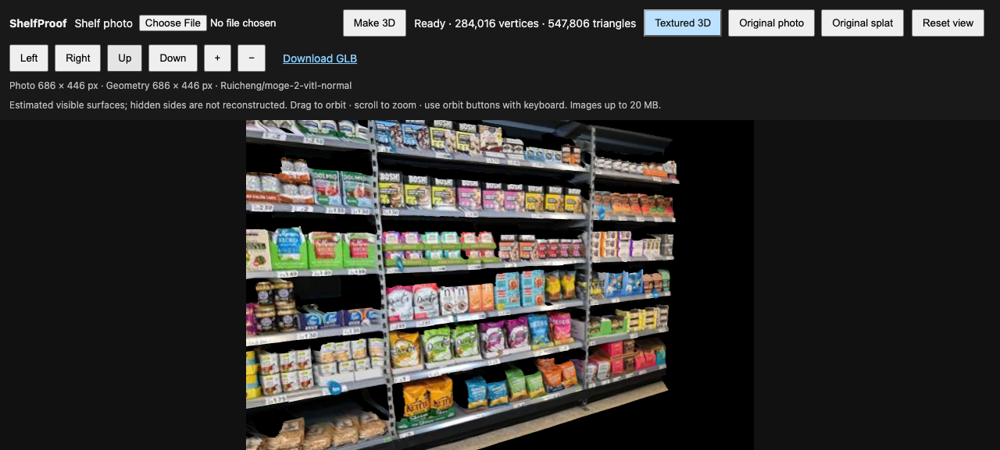
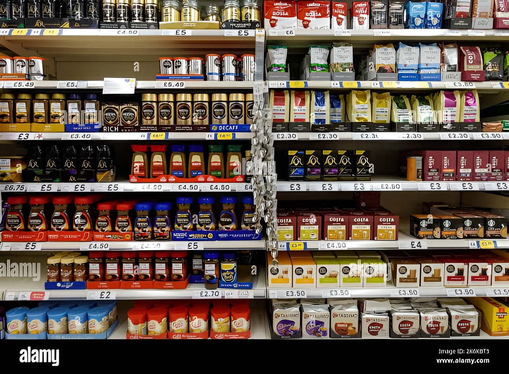
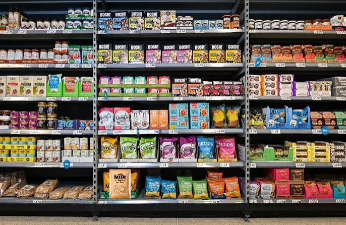
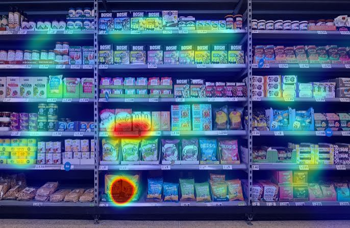
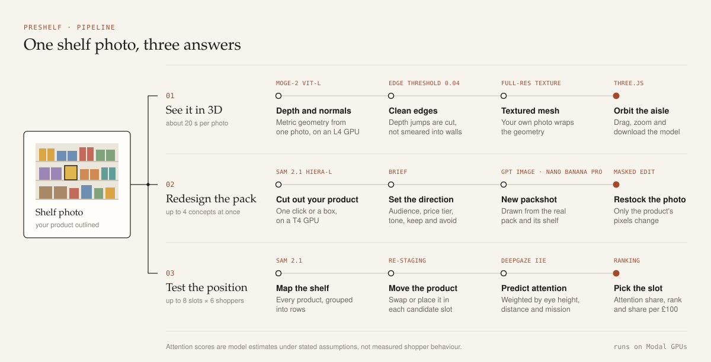

# PreShelf

Test your packaging and shelf placement on the shelf you actually have to win.



Upload one photo of a supermarket shelf. PreShelf turns it into a 3D aisle you can orbit, redesigns your pack in place next to its real competitors, and predicts which spot on the shelf earns the most attention for what it costs.

## Why this exists

Brands pay retailers for shelf space and then mostly guess which design, and which shelf, will sell. The obvious guess can be wrong. In a 2009 eye-tracking study in the *Journal of Marketing*, middle shelves caught shoppers' eyes, but only the top shelf changed how they rated the brand. The same study found that extra facings helped mainly because they won attention.

Shelf space isn't cheap either. The FTC found that slotting fees, paid just to get a new product onto the shelf, can make up a large fraction of some products' first-year revenue. Commercial shelf tests do exist, but you can wait up to a week for results, and they run on a generic mock shelf rather than the store you're walking into.

PreShelf starts from a photo of that store.

## What you can do

### 1. Walk the aisle in 3D

About twenty seconds after you upload a photo, it's a textured 3D model you can drag, zoom and download. MoGe-2 estimates the shelf's geometry and surface normals from that single image, and the texture is your original photo at full resolution, so competitors' labels look the way they did in the store. Where one product stands in front of another, the mesh splits at the edge instead of stretching a fake wall between them.

### 2. Redesign your pack where it lives

Click your product, or drag a box around it, and SAM 2.1 cuts it out of the shelf. Write a short brief covering who you're selling to, your price tier, the tone, and what has to stay or go. PreShelf generates up to four concepts in different creative directions, working from the real pack and the shelf around it.

Each concept is then printed back into the original photo with a masked edit. The new pack sits at the same angle, under the same light, beside the same neighbours, and nothing outside your product changes.

| Before | After |
| --- | --- |
|  |  |

*The Kettle Chips bag on the bottom row is the only thing that changed.*

### 3. Find the shelf spot that pays

PreShelf finds every product on the shelf and groups them into rows. It then rebuilds the scene with your product moved into each position you want to compare, up to eight, either swapped with a neighbour or placed in a gap.

For each scene, DeepGaze IIE, a saliency model trained on human eye-tracking data, predicts where people look. PreShelf weights that prediction by who is looking. Five shopper presets come built in, and you can add your own:

- an 8-year-old with eyes at 115 cm
- an average adult
- a tall adult in a hurry, searching for a named brand
- a budget shopper scanning the lower shelves
- a wheelchair user



You get a ranked list of slots, a heatmap for every shopper, and a recommendation in plain sentences: how much more attention the best slot earns than your current one, which shoppers would disagree, and who sees you least there. Enter what each slot costs, and PreShelf shows attention per £100 so you can tell whether eye level is worth paying for.

## How it works



| Step | Model | What it does |
| --- | --- | --- |
| 3D shelf | [MoGe-2](https://github.com/microsoft/MoGe) ViT-L, on an L4 GPU | Estimates geometry and surface normals from one image in about a second |
| Product cut-out | [SAM 2.1](https://github.com/facebookresearch/sam2) Hiera-L, on a T4 GPU | Turns a click or box into a pixel-accurate product mask |
| Pack concepts | GPT Image or Nano Banana Pro, via Runware | Draws a new front-of-pack from the real pack, any side photos you add, and its shelf |
| Back on the shelf | GPT Image masked edit | Repaints only the product region so lighting and perspective match |
| Shelf layout | SAM 2.1 | Finds every product and groups them into shelf rows |
| Attention | [DeepGaze IIE](https://github.com/matthias-k/DeepGaze) | Predicts where eyes land on each re-staged shelf |

Everything runs on Modal GPUs and shows up in an ordinary browser tab.

## What the numbers mean

Attention scores are model estimates under stated assumptions. They are not measured shopper behaviour, and the app says so on every result.

The assumptions are visible and editable: shelf height, how far away the photo was taken, each shopper's eye height, viewing distance, mission and time pressure. The scoring formula sits next to the results. The shopper weights come from published findings: shoppers favour the centre of a display (Atalay et al., 2012), and under time pressure they fix on fewer, more prominent items (Reutskaja et al., 2011). None of it has been calibrated against real sales.

PreShelf also never invents detail. Text you can read in the 3D model is text the camera captured, and the hidden sides of products aren't reconstructed. Generated packs are concepts, so check label text and claims before anything goes to print.

## Next

Score every packaging concept with the same attention model, so the lab tells you which design wins instead of just showing you the options.

## Research

- Chandon, Hutchinson, Bradlow and Young (2009). [Does In-Store Marketing Work? Effects of the Number and Position of Shelf Facings on Brand Attention and Evaluation at the Point of Purchase](https://papers.ssrn.com/sol3/papers.cfm?abstract_id=1406506). *Journal of Marketing* 73(6).
- Federal Trade Commission (2003). [Slotting Allowances in the Retail Grocery Industry](https://www.ftc.gov/reports/use-slotting-allowances-retail-grocery-industry).
- Atalay, Bodur and Rasolofoarison (2012). Shining in the Center: Central Gaze Cascade Effect on Product Choice. *Journal of Consumer Research*.
- Reutskaja, Nagel, Camerer and Rangel (2011). Search Dynamics in Consumer Choice under Time Pressure: An Eye-Tracking Study. *American Economic Review*.
- Smurfit Kappa and EyeSee (2014). [Disruptive shelf-ready packaging spotted by 76% more shoppers](https://www.smurfitkappa.com/newsroom/2014/disruptive-shelf-ready-packaging-spotted-by-76-more-shoppers). A virtual-shelf test that returns results within a week.

## Run it

You'll need [uv](https://docs.astral.sh/uv/), a [Modal](https://modal.com) account, and a Runware API key in a `.env` file as `RUNWARE_API_KEY=...`.

```sh
uv sync
uv run modal serve shelfproof/app.py
```

Open the URL Modal prints and upload a shelf photo. A sharp, straight-on photo gives the best result, and the app accepts images up to 20 MB.
